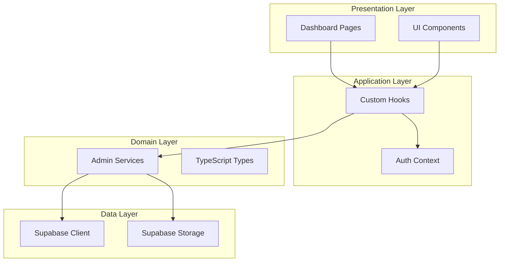

# Dashboard Development Master Plan

**Project:** Admin Dashboard for Portfolio  
**Owner:** Hamza Fuad Hajeb  
**Stack:** React 19 + TypeScript + Vite | Tailwind CSS | Supabase  
**Created:** 2026-01-24

---

## Overview

A comprehensive admin dashboard for managing the bilingual portfolio. Built with **clean architecture** using proper separation of concerns.



---

## Phase Overview

| Phase | Name | Est. Time | Priority | Status |
|-------|------|-----------|----------|--------|
| 01 | [Foundation & Authentication](file:///d:/EnovaStudio/HamzaHajib/Dashboard_Tracker/phases/phase-01-auth.md) | 4-6 hrs | 🔴 Critical | ⬜ Pending |
| 02 | [Core Dashboard Structure](file:///d:/EnovaStudio/HamzaHajib/Dashboard_Tracker/phases/phase-02-structure.md) | 3-4 hrs | 🔴 Critical | ⬜ Pending |
| 03 | [Dashboard Overview](file:///d:/EnovaStudio/HamzaHajib/Dashboard_Tracker/phases/phase-03-overview.md) | 2-3 hrs | 🟡 High | ⬜ Pending |
| 04 | [Projects Management](file:///d:/EnovaStudio/HamzaHajib/Dashboard_Tracker/phases/phase-04-projects.md) | 6-8 hrs | 🔴 Critical | ⬜ Pending |
| 05 | [Contact Messages](file:///d:/EnovaStudio/HamzaHajib/Dashboard_Tracker/phases/phase-05-messages.md) | 3-4 hrs | 🟡 High | ⬜ Pending |
| 06 | [Categories & Tags](file:///d:/EnovaStudio/HamzaHajib/Dashboard_Tracker/phases/phase-06-categories.md) | 3-4 hrs | 🟡 High | ⬜ Pending |
| 07 | [Media Management](file:///d:/EnovaStudio/HamzaHajib/Dashboard_Tracker/phases/phase-07-media.md) | 4-6 hrs | 🟢 Medium | ⬜ Pending |
| 08 | [Settings & Translations](file:///d:/EnovaStudio/HamzaHajib/Dashboard_Tracker/phases/phase-08-settings.md) | 3-4 hrs | 🟢 Medium | ⬜ Pending |
| 09 | [Shared UI Components](file:///d:/EnovaStudio/HamzaHajib/Dashboard_Tracker/phases/phase-09-components.md) | 4-5 hrs | 🔴 Critical | ⬜ Pending |
| 10 | [Polish & Testing](file:///d:/EnovaStudio/HamzaHajib/Dashboard_Tracker/phases/phase-10-polish.md) | 4-6 hrs | 🟡 High | ⬜ Pending |

**Total Estimated Time:** 40-50 hours

---

## File Structure (Target)

```
src/
├── components/
│   ├── auth/
│   │   └── ProtectedRoute.tsx
│   └── dashboard/
│       ├── DashboardLayout.tsx
│       ├── Sidebar.tsx
│       ├── DashboardHeader.tsx
│       └── ui/
│           ├── Button.tsx
│           ├── DataTable.tsx
│           ├── Modal.tsx
│           ├── Toast.tsx
│           └── ...
├── context/
│   └── AuthContext.tsx
├── pages/
│   └── dashboard/
│       ├── Login.tsx
│       ├── DashboardOverview.tsx
│       ├── projects/
│       ├── messages/
│       ├── categories/
│       ├── tags/
│       ├── media/
│       └── settings/
├── services/
│   ├── auth.service.ts
│   ├── dashboard.service.ts
│   └── admin/
│       ├── projects.admin.service.ts
│       ├── contacts.admin.service.ts
│       └── ...
├── hooks/
│   └── useAuth.ts
└── types/
    └── admin.ts
```

---

## Quick Links

- **Phases Folder:** [phases/](file:///d:/EnovaStudio/HamzaHajib/Dashboard_Tracker/phases/)
- **Current Portfolio:** [Live Site](https://hider2001.github.io/HamzaHajib/)
- **Supabase Schema:** [supabase_schema.sql](file:///d:/EnovaStudio/HamzaHajib/supabase_schema.sql)
